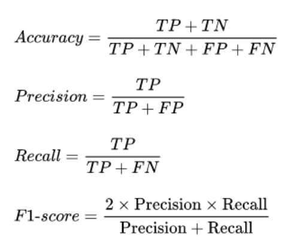
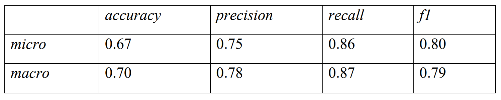
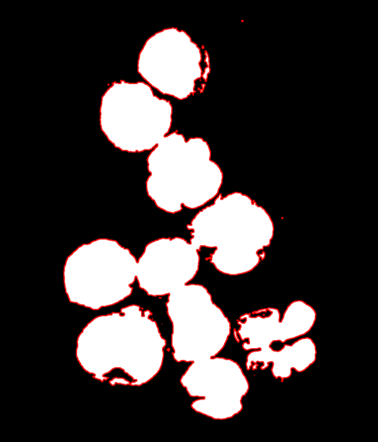

# Blast Cell Detector

This project aims to implement and evaluate an object detection algorithm based on polygonal data. An algorithms allow you to automatically identify areas of cluster of blast cells in the image.

## Dataset
The dataset was created independently and consists of a set of polygons that serve as reference data (`ground_truth'). Each polygon is represented as vertex coordinates and is used to create binary images. These images are then used to evaluate the quality of the detection algorithm.

more: https://github.com/K-Grachev-2106756/blast_cell_dataset

## Quality assessment


The following methodology is used to evaluate the quality of the algorithm:

1. **Creating binary images of polygons**:
- A binary image is created for each polygon from `ground_truth`.

2. **Intersection with detection**:
- The intersection of each binary image with the detection result is performed.
   - If the area of intersection of detection and `ground_truth` >= 0.8, then it is considered **True Positive** (TP).
- - If the area of intersection is less than 0.8, then it is considered **False Negative** (FN).
   
3. **Detection update**:
   - After determining the intersection, the corresponding area of the image is removed from detection.

4. **Creating a combined ground_truth image**:
- All binary polygon images are combined into one large `groundTruth` image.

5. **Detection of false Positives**:
- The remaining detection components that do not fall on the `groundTruth` are considered **False Positive** (FP).

## Results

The long algorithm (BGR) has high enough metrics. 



It uses K-Means clustering to find a color similar to the cell color – purple (128, 0, 128) and dark blue (30, 30, 90). The image is divided into color channels, after which the effective range for each found color is searched for each channel. After morphological closure, the components of connectivity are determined and morphological closure is repeated for each component of connectivity.



## Instruction

1. Download the dataset to the project folder (if necessary):

```
git clone https://github.com/K-Grachev-2106756/blast_cell_dataset.git
```

2. Build the project and run “./main.exe”

3. If desired, you can specify the parameters:
-mode ("BGR" or "HSV")
-imgPath (path to the file for detection)
-groundTruthPath (path to the validation file)

Examples:

• ./main.exe -mode=HSV – will start detection for each
dataset image and calculate metrics. Saves the results to a folder with the dataset.

• ./main.exe -imgPath="../blast_cell_dataset/images/4.jpg" -mode=BGR -
it will start the detection of a single image without validation. The detection result
will be saved to the file folder.
